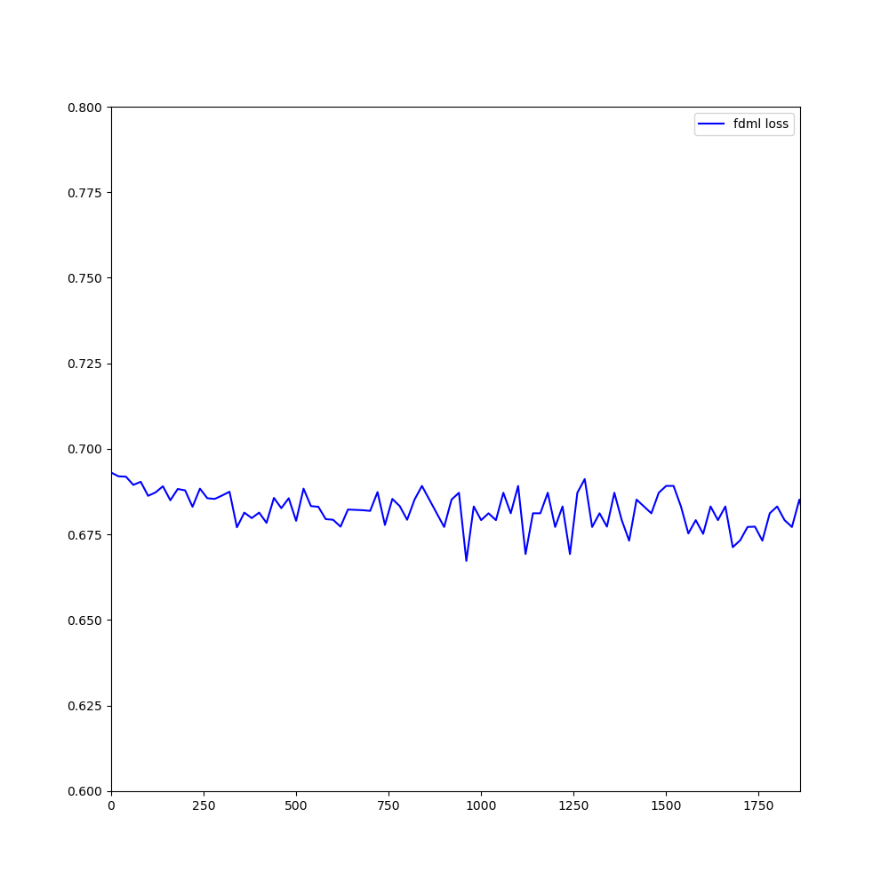

# fdml mini-batch results
- iteration time:
> batch size: 256, iteration time: 3.7s
- epoch time:
> eplapsed: 68323.17s
- test loss:
> test_logloss: 0.6847, 0.6733, 0.6713, 0.6753, 0.6772, 0.6713
- test auc:
- training loss curve:

# a9a no noise test loss 
- rho 3, lamda 0.0001
# a9a noise 0.1 test loss
- rho 0.3, lamda 0.0001
# a9a noise 0.3 test loss
- rho 0.1, lamda 0.0001